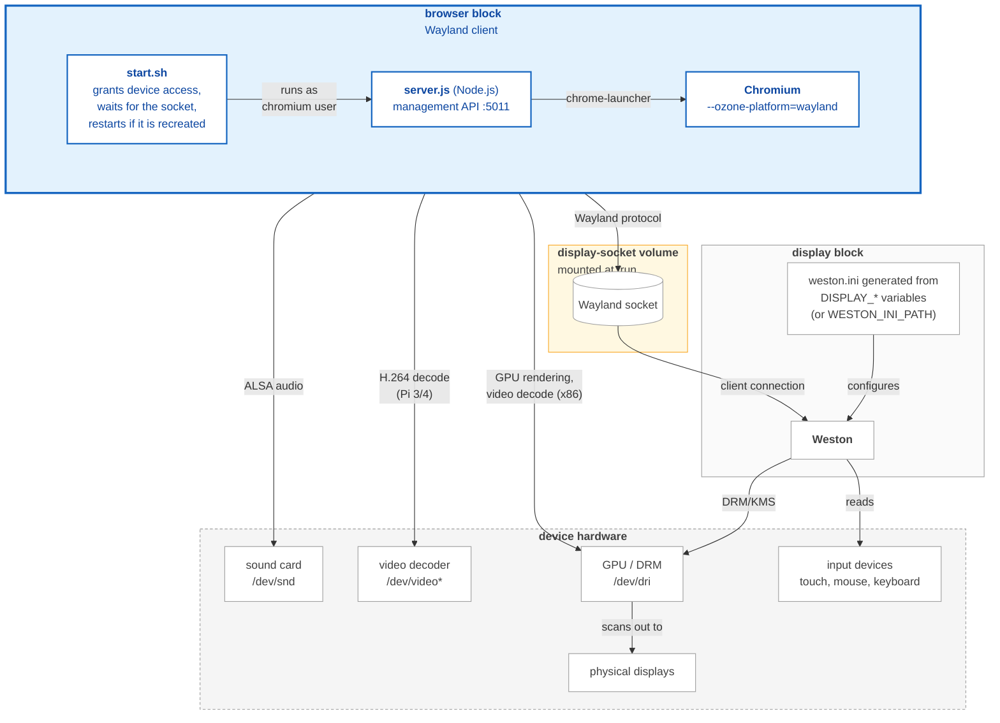

# browser

Provides a hardware accelerated web browser to present internal and external URLs on a connected display.
The `browser` [block](https://docs.balena.io/learn/develop/blocks) is a docker image that runs a [Chromium](https://www.chromium.org/Home) browser as a [Wayland](https://wayland.freedesktop.org/) client, optimized for balenaOS.
It renders through a companion **display** (compositor) block, and provides an API for dynamic configuration.

> [!IMPORTANT]
> **Upgrading from v2?** v3 moves from X11 to Wayland and changes the image namespace. See the
> [v2 → v3 migration guide](docs/migrating-from-v2.md).

---
## Features

- Chromium browser optimized for device arch
- Hardware video acceleration (if enabled)
- Optional KIOSK mode
- Remotely configurable launch URL
- Automatically displays local HTTP (port 80 or 8080) or HTTPS (443) service endpoints.
- API for remote configuration and management
- Optional remote debugging from another host

---

## Usage

The `browser` block renders through a companion **display** (compositor) block. Run both services,
share a volume mounted at `/run` so the browser can reach the Wayland socket, and reference the
`browser` image for your **device type** (one of `raspberrypi3-64`, `raspberrypi4-64`,
`raspberrypi5`, `generic-aarch64`, `generic-amd64`).

#### docker-compose file
To use this image, create your `docker-compose.yml` file as shown below:

```yaml
version: '2.4'

volumes:
  display-socket:                    # Shared Wayland runtime directory
  settings:                          # Only required if using PERSISTENT flag (see below)

services:

  display:
    image: bh.cr/balenasolutions/display-<arch> # <arch> is aarch64 or amd64; see https://github.com/balenasolutions/display
    privileged: true
    volumes:
      - display-socket:/run
    labels:
      io.balena.features.dbus: '1'

  browser:
    image: bh.cr/balenasolutions/browser-<device-type> # e.g. raspberrypi4-64, raspberrypi5, generic-amd64
    privileged: true # required for UDEV to find plugged in peripherals such as a USB mouse
    depends_on:
      - display
    environment:
      XDG_RUNTIME_DIR: /run/user/0
      WAYLAND_DISPLAY: wayland-0
    devices:
      - /dev/dri:/dev/dri
    ports:
      - '5011:5011' # management API
    volumes:
      - display-socket:/run
      - 'settings:/data' # Only required if using PERSISTENT flag (see below)
```

To pin to a specific [version](CHANGELOG.md) of this block, append the version to the image, e.g.
`bh.cr/balenasolutions/browser-<device-type>/<version>`.

See [here](https://github.com/balena-io/open-balena-registry-proxy#usage) for more details about how to use blocks hosted in balenaCloud.

---

## Environment variables

The following environment variables allow configuration of the `browser` block:

| Environment variable | Options | Default | Description |
| --- | --- | --- | --- |
|`LAUNCH_URL`|`http` or `https` URL|N\A|Web page to display|
|`LOCAL_HTTP_DELAY`|Number (seconds)|0|Number of seconds to wait for a local HTTP service to start before trying to detect it|
|`KIOSK`|`0`, `1`|`0`|Run in kiosk mode with no menus or status bars. <br/> `0` = off, `1` = on|
|`FLAGS`|[many!](https://peter.sh/experiments/chromium-command-line-switches/)|N/A|**Replaces** the flags chromium is started with. Enter a space (\' \') separated list of flags (e.g. `--noerrdialogs --disable-session-crashed-bubble`) <br/> **Use with caution!**|
|`EXTRA_FLAGS`|[many!](https://peter.sh/experiments/chromium-command-line-switches/)|N/A|Adds **additional** flags chromium is started with. Enter a space (\' \') separated list of flags (e.g. `--audio-buffer-size=2048 --audio-output-channels=8`)|
|`PERSISTENT`|`0`, `1`|`0`|Enables/disables user profile data being stored on the device. **Note: you'll need to create a settings volume. See example above** <br/> `0` = off, `1` = on|
|`ENABLE_GPU`|`0`, `1`|0|Master hardware-acceleration switch. Enables GPU **rendering** (rasterization, compositing, WebGL/canvas) and, by default, best-effort hardware **video decode**. On Raspberry Pi, decode is handled by the Pi-patched Chromium (verify via `MojoVideoDecoder`/`V4L2VideoDecoder` in `chrome://media-internals`); on x86 it enables the Mesa VA-API path. <br/> `0` = off, `1` = on|
|`DISABLE_VIDEO_DECODE`|`0`, `1`|0|Opt **out** of hardware video decode while keeping GPU rendering on. Use on devices where the decode path misbehaves. No effect unless `ENABLE_GPU=1`. <br/> `0` = decode stays on, `1` = decode off|
|`API_PORT`|port number|5011|Specifies the port number the API runs on|
|`ENABLE_REMOTE_DEBUG`|`0`, `1`|`0`|Exposes Chromium's remote debugging interface on `REMOTE_DEBUG_PORT` so it can be reached from another host (see [Remote debugging](#remote-debugging)). **No authentication or encryption.** <br/> `0` = off, `1` = on|
|`REMOTE_DEBUG_PORT`|port number|35173|Port the remote debugging relay listens on when `ENABLE_REMOTE_DEBUG=1`. Has no effect otherwise|
|`AUTO_REFRESH`|interval|0 (disabled)|Specifies the number of seconds before the page automatically refreshes|
|`ENABLE_DIAGNOSTICS`|`0`, `1`|`0`|Enables the `/diagnostics/*` API endpoints, which expose Chromium version, GPU and media-decoder state. Off by default. <br/> `0` = off, `1` = on|

> [!IMPORTANT]
> **Display geometry (rotation, resolution, scale) is configured on the `display` block,
> not here.** In v3 the browser is a Wayland client and the compositor owns the screen, so the v2
> `ROTATE_DISPLAY`, `ROTATE_DELAY`, `TOUCHSCREEN`, `WINDOW_SIZE`, `WINDOW_POSITION`, `SHOW_CURSOR` and
> `DISPLAY_NUM` variables no longer apply. Set `DISPLAY_ROTATION` / `DISPLAY_RESOLUTION` /
> `DISPLAY_SCALE` on the `display` service instead — see [its README](https://github.com/balenasolutions/display#display-geometry--rotation) and
> [Migrating from v2](docs/migrating-from-v2.md#7-screen-rotation--display-geometry-moved-to-the-display-block).

---

## Choosing what to display
If you want the `browser` to display a website, you can set the `LAUNCH_URL` as noted above. However, you can also drop the `browser` into a multicontainer app, and use it to display the (HTTP, port 80 or 8080, or HTTPS port 443) output of another service, such as a Grafana dashboard. The `browser` will automatically detect that a service is running a HTTP server  and display that. Just make sure that you don't set a `LAUNCH_URL` environment variable, as they take precedence. Example:

*docker-compose.yml*
```yaml
version: '2.1'
volumes:
  settings:
services:
  browser:
    restart: always
    image: bh.cr/balenasolutions/browser-<device-type>
    privileged: true
    volumes:
      - 'settings:/data'
  grafana:
    restart: always
    build: ./grafana
    ports:
      - "80"
```
---

## Audio

The `browser` block plays audio **directly via ALSA** to the device's sound
hardware — no extra container or configuration is required. The block
automatically grants its unprivileged `chromium` user access to the kernel sound
devices (`/dev/snd/*`); see [`src/start.sh`](src/start.sh). `privileged: true`
(already set in the example `docker-compose.yml`) is required so those devices are
visible to the container.

In practice audio is emitted on the device's active output. For example, with an
HDMI screen connected the sound travels over HDMI, and the 3.5mm headphone jack
works when used (verified on a Raspberry Pi 4). The kernel/ALSA default decides
which output is used; the browser block does not currently expose a knob to
select a specific output.

To force a specific output without any additional container, you can bake an
[`/etc/asound.conf`](https://www.alsa-project.org/wiki/Asoundrc) into a derived
image that pins ALSA's default device to the card you want — for example the
Raspberry Pi 4 headphone jack:

```Dockerfile
FROM bh.cr/balenasolutions/browser-<device-type>
RUN printf 'pcm.!default {\n  type plug\n  slave.pcm "hw:Headphones"\n}\nctl.!default {\n  type hw\n  card Headphones\n}\n' > /etc/asound.conf
```

Use the card name as reported by `aplay -l` (e.g. `Headphones`, `vc4hdmi0`,
`vc4hdmi1`); names are more stable across reboots than numeric indices.

For richer routing — selecting a specific sink at runtime, Bluetooth output, or
sharing audio across multiple containers — run a dedicated sound server such as
the [`audio` block](https://github.com/balena-labs-projects/audio), PipeWire, or
similar, and point the browser at it. This is no longer wired in by default; if
you are migrating from v2 and want to retain the audio block, see
[Migrating from v2 → Audio](docs/migrating-from-v2.md#8-audio-no-longer-pre-wired-to-the-audio-block).

---

## API

The `browser` block serves an HTTP API on port `5011` (set `API_PORT` to change it). The examples
call it from another machine at `<device-ip>`; on the device itself, use `localhost`.

| Method | Endpoint | Description |
| --- | --- | --- |
| `GET` | [`/ping`](#get-ping) | Health check |
| `GET` | [`/url`](#get-url) | Current URL |
| `POST` | [`/url`](#post-url) | Display a URL |
| `POST` | [`/refresh`](#post-refresh) | Reload the page |
| `POST` | [`/autorefresh/{interval}`](#post-autorefreshinterval) | Reload the page on a timer |
| `POST` | [`/scan`](#post-scan) | Look again for a local web service |
| `GET` | [`/kiosk`](#get-kiosk) | Kiosk mode state |
| `POST` | [`/kiosk/{value}`](#post-kioskvalue) | Turn kiosk mode on or off |
| `GET` | [`/gpu`](#get-gpu) | GPU acceleration state |
| `POST` | [`/gpu/{value}`](#post-gpuvalue) | Turn GPU acceleration on or off |
| `GET` | [`/flags`](#get-flags) | Chromium launch flags |
| `GET` | [`/version`](#get-version) | Block version |
| `GET` | [`/screenshot`](#get-screenshot) | PNG of the current page |
| `GET` | [`/diagnostics/*`](#diagnostics) | Troubleshooting data (off by default) |

### Page

#### `GET /ping`

Returns `200 ok` once the API is running. Use it as a readiness check.

#### `GET /url`

Returns the URL currently on screen.

#### `POST /url`

Displays a new URL. Send the parameters as form data or JSON.

| Parameter | Required | Description |
| --- | --- | --- |
| `url` | yes | Page to display. `http://` is added if the URL has no scheme. |
| `kiosk` | no | `1` turns kiosk mode on, `0` turns it off. |
| `gpu` | no | `1` turns GPU acceleration on, `0` turns it off. |

Changing `kiosk` or `gpu` restarts Chromium; otherwise the page changes in place. A request
without `url` returns `400`.

```bash
curl -X POST --data "url=www.balena.io" http://<device-ip>:5011/url
curl -X POST --data "url=www.balena.io&gpu=0&kiosk=1" http://<device-ip>:5011/url
```

#### `POST /refresh`

Reloads the current page.

#### `POST /autorefresh/{interval}`

Reloads the page every `interval` seconds. `0` turns automatic refresh off.

```bash
curl -X POST http://<device-ip>:5011/autorefresh/30
```

#### `POST /scan`

Looks again for a local HTTP or HTTPS service to display. A local service can call this once it
is ready, to avoid a startup race with the browser.

> [!NOTE]
> Local services are only detected when `LAUNCH_URL` is not set.

### Display mode

#### `GET /kiosk`

Returns `1` if kiosk mode is on, `0` if it is off.

#### `POST /kiosk/{value}`

`1` turns kiosk mode on, `0` turns it off. Chromium restarts to apply the change.

```bash
curl -X POST http://<device-ip>:5011/kiosk/1
```

#### `GET /gpu`

Returns `1` if GPU acceleration is on, `0` if it is off.

#### `POST /gpu/{value}`

`1` turns GPU acceleration on, `0` turns it off. Chromium restarts to apply the change. Any other
value returns `400`.

```bash
curl -X POST http://<device-ip>:5011/gpu/1
```

### Info

#### `GET /flags`

Returns the command-line flags Chromium was started with.

#### `GET /version`

Returns the `browser` block version.

#### `GET /screenshot`

Returns a PNG of the current page, captured through the Chromium DevTools Protocol.

```bash
curl -o screenshot.png http://<device-ip>:5011/screenshot
```

### Diagnostics

These endpoints expose internal Chromium state for troubleshooting hardware acceleration. They are
**off by default**: set `ENABLE_DIAGNOSTICS=1` to turn them on. While off, they return `404`.
While on, Chromium also logs to `/tmp/chrome_debug.log` in the container, so the report can
include its GPU, decoder and audio errors.

| Method | Endpoint | Returns |
| --- | --- | --- |
| `GET` | `/diagnostics/report` | A single text file with device and host info, config and flags, Chromium GPU and media state, and recent block and Chromium logs. Attach it to bug reports. |
| `GET` | `/diagnostics/version` | Chromium build and block version (JSON) |
| `GET` | `/diagnostics/gpu` | GPU feature status, drivers and active backend: the same data as `chrome://gpu` (JSON) |
| `GET` | `/diagnostics/media` | The decoder each active media player uses and whether it is hardware accelerated, such as `V4L2VideoDecoder` (JSON) |
| `GET` | `/diagnostics/vainfo` | Raw `vainfo` output listing the VA-API profiles the driver exposes (plain text). `vainfo` is only bundled on `generic-amd64`; other images report that it is not installed. |

To save the report:

```bash
curl -OJ http://<device-ip>:5011/diagnostics/report
```

---

## Remote debugging

Chromium's DevTools endpoint binds to localhost only and ignores `--remote-debugging-address`
outside headless mode, so mapping the port alone does not make it reachable from another machine.
Set `ENABLE_REMOTE_DEBUG=1` to run a small TCP relay that forwards `REMOTE_DEBUG_PORT` (default
`35173`) to Chromium, and map that port in your compose file:

```yaml
    ports:
      - '5011:5011'
      - '35173:35173'
```

Then add the device as a target in `chrome://inspect/#devices` on another machine, connecting by IP
address (`<device-ip>:35173`).

> [!CAUTION]
> The remote debugging interface has **no authentication or encryption** — anyone who can reach
> the port gets full control of the browser. Only enable it on a trusted/private network, or leave
> the port unmapped and reach it through an SSH tunnel instead.

---

## Supported devices

The block builds for two architectures (`aarch64`, `amd64`) and bundles the Mesa
GPU/VA-API drivers, so it will *run* on a wide range of hardware. We distinguish two levels of
support:

**Tested** — exercised on real hardware, including hardware video decode where applicable:

| Device Type | Notes |
| --- | --- |
| Raspberry Pi 3 (64-bit OS) | H.264 hardware decode |
| Raspberry Pi 4 / Pi 400 | H.264 hardware decode |
| Raspberry Pi 5 | GPU rendering; H.264 falls back to software decode |
| Intel NUC | VA-API hardware decode (Mesa) |
| Generic AMD64 | VA-API hardware decode (Mesa) |
| Generic AARCH64 | GPU rendering; software video decode |

**Technically supported** — other devices of the same architecture should boot and render, but we
haven't validated them and hardware video decode is not guaranteed (it depends on the device's
kernel drivers). Use the generic `aarch64`/`amd64` images.

> [!NOTE]
> 32-bit Raspberry Pi OS and the balena Fin (`fincm3`) are no longer targeted. Use the
> 64-bit (`aarch64`) OS on Raspberry Pi.

---

## Hardware acceleration

Hardware acceleration is controlled by a single master switch with one optional override:

- **`ENABLE_GPU=1`** turns on GPU rendering **and** best-effort hardware video decode. For most
  kiosks (including video playback) this is the only variable you need.
- **`DISABLE_VIDEO_DECODE=1`** opts out of decode while keeping GPU rendering — for devices where the
  decode path misbehaves.

The prefix tells you the default: `ENABLE_*` is off until you set it; `DISABLE_*` is on until you set
it.

> [!NOTE]
> **Upgrading?** `ENABLE_GPU=1` continues to give you hardware video decode, as it always has —
> nothing to change for existing video kiosks.

> [!WARNING]
> Hardware **video encode** is currently **not supported** (e.g. WebRTC capture/streaming may not
> work — see [#168](https://github.com/balena-io-experimental/browser/issues/168)).

What to expect per target (with `ENABLE_GPU=1`):

- **Raspberry Pi 4 / Pi 400 / Pi 3 (64-bit)** — H.264 hardware decode via the Pi-patched Chromium
  (`bcm2835-codec`). Verify in `chrome://media-internals`: the decoder shows as `V4L2VideoDecoder`
  with `isHardwareAccelerated: true`.
- **Raspberry Pi 5** — the video block is HEVC-only and the distro Chromium ships without proprietary
  codecs, so H.264 falls back to **software decode**. GPU rendering still works.
- **Generic x86_64 (Intel/AMD)** — VA-API hardware decode (e.g. H.264 shows as `VaapiVideoDecoder`
  with `hardware: true` in `chrome://media-internals`). AMD uses `mesa-va-drivers`; Intel uses its
  own driver (`intel-media-va-driver`/iHD for Gen8+, `i965-va-driver` for older parts).
- **Generic AARCH64** — software video decode (no guaranteed kernel decoder).

---

## Architecture

The `browser` block is a Wayland client. It does not drive the screen itself: the
[**display** block](https://github.com/balenasolutions/display) runs the Weston compositor, which owns the outputs and input devices. Weston creates the Wayland
socket on a volume mounted at `/run` in both containers, and Chromium connects to it. Chromium
still renders with the GPU and decodes video in hardware itself, then hands finished frames to
the compositor.


---

## Troubleshooting
This section provides some guidance for common issues encountered:

#### Black border on HDMI display
Thanks to 1980's CRT televisions, manufacturers had to invent a method for cutting off the edges of a picture to ensure the "important" bits were displayed nicely on the screen. This is called `overscan` and there's a good article on it [here](https://www.howtogeek.com/252193/hdtv-overscan-what-it-is-and-why-you-should-probably-turn-it-off/).
If, when you plug one of the supported devices into your HDMI screen, you find black borders around the picture, you need to disable overscan. For the device this can be achieved by setting a [Device Configuration variable](https://www.balena.io/docs/learn/manage/configuration/#:~:text=Define%20fleet%2Dwide%3A-,Managing%20device%20configuration%20variables,of%20the%20device%20configuration%20variable.) called `BALENA_HOST_CONFIG_disable_overscan` and setting the value to `1`:


You may also need to turn it off on the screen itself (check your device instructions for details).

#### Partial/strange display output
Occasionally users report weird things are happening with their display output like:
* Only a portion of the browser screen appears on their display
* The screen is displaying skewed or fragmented
* Colors have changed dramatically

Here are some things to try:
* Setting the WINDOW_SIZE manually to your display's resolution (e.g. `1980,1080`) - the display may be mis-reporting it's resolution to the device
* Increase the memory being allocated to the GPU with the Device Configuration tab on the dashboard, or via [configuration variable](https://www.balena.io/docs/learn/manage/configuration/) - for large displays the device may need to allocate more memory to displaying the output

